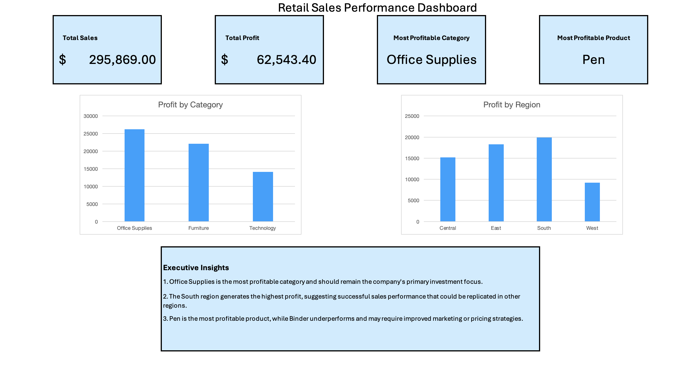

# 📊 Retail Sales Analysis Dashboard

## Project Overview
This project analyzes a retail sales dataset using Microsoft Excel to identify the most profitable products, categories, and regions. The goal is to transform raw sales data into business insights that support decision-making through an executive dashboard.

---

## Tools Used
- Microsoft Excel
- Pivot Tables
- Pivot Charts
- Dashboard Design
- Business Analysis

---

## Business Questions
- Which category generates the highest profit?
- Which product is the most profitable?
- Which region performs best?
- What recommendations can improve profitability?

---

## Dashboard Preview

---

## Key Findings
- Office Supplies is the most profitable category.
- Pen is the most profitable product.
- South is the highest-performing region.
- Binder underperforms and may require additional marketing efforts.

---

## Business Recommendations
- Continue investing in the Office Supplies category.
- Maintain strong inventory for the Pen product.
- Analyze why the West region generates lower profits.
- Improve marketing strategies for low-performing products.

---

## Skills Demonstrated
- Data Analysis
- Business Intelligence
- Executive Reporting
- Data Visualization
- Microsoft Excel
